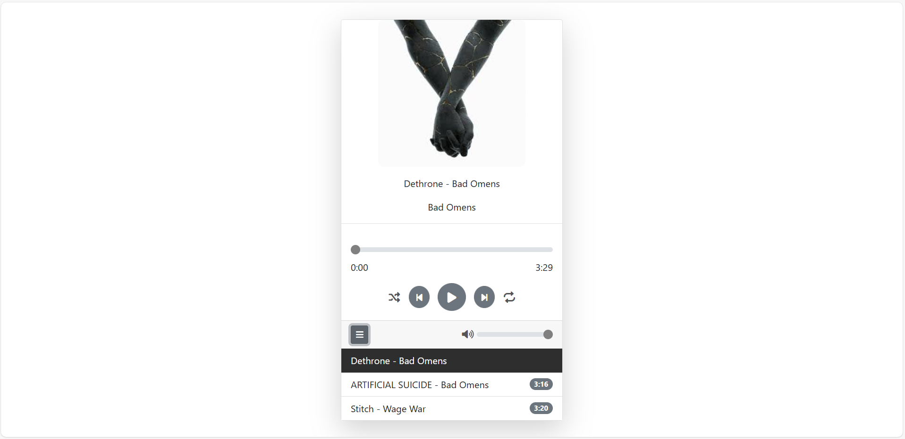

# 🎵 Music Player

A functional and responsive **Music Player** built using **JavaScript**, **HTML**, **CSS**, and **Bootstrap**. This app plays real `.mp3` files and features a clean interface with a playlist and playback controls.

---

## 🚀 Features

- ▶️ Play / Pause music
- ⏭️ Next / Previous track navigation
- 🔁 Repeat mode
- 🔀 Shuffle mode
- 📜 Playlist display with durations
- 🎶 Highlights the currently playing or selected song in the list
- 🔊 Volume control with mute/unmute toggle
- 🎧 Automatically plays the next track when one ends

---

## 📁 Project Structure

```
MusicPlayer/
├── img/
│ └── [cover images for each song]
|
├── js/
│ ├── app.js
│ ├── music.js
│ └── musicplayer.js
|
├── mp3/
│ └── [.mp3 music files]
|
├── screenshot/
│ └── [application image]
|
├── index.html
├── style.css
└── README.md
```

---

## 🛠️ Technologies Used

- HTML5
- CSS3
- Bootstrap 5
- Vanilla JavaScript (ES6+)

---

## 💡 How It Works

- Music files are stored locally in the `mp3/` folder and are played dynamically through JavaScript.
- All operations (such as displaying the playlist, updating the UI, and controlling playback) are handled with **DOM manipulation**.
- Even though the number of tracks is currently limited, it can be easily expanded with additional songs.
- The interface is styled using **Bootstrap**, making it responsive and compatible with most modern browsers and mobile devices.

---

## 🖼️ Screenshot

> 

---

## ▶️ Getting Started

1. Clone the repository:
   ```bash
   git clone https://github.com/Selinoztrk/music-player.git
   ```
2. Open the folder and double-click `index.html` to launch it in your browser.

---

👩‍💻 Developer
**Selin Öztürk**

Feel free to improve the project or fork it to add new features! 🚀

---
